# ChatDocAI - Architecture Documentation

## System Architecture Overview

ChatDocAI implements a sophisticated multi-tier architecture combining knowledge graphs, vector search, and intelligent query planning for document intelligence.

## Core Components

### 1. Document Processing Pipeline


**Key Features:**
- **Hybrid Processing**: PyMuPDF for speed, Docling for accuracy
- **Smart Chunking**: Respects paragraph boundaries, maintains context
- **Concurrent Processing**: 2 documents simultaneously
- **Format Support**: 15+ formats including PDF, DOCX, EML, HTML, RTF

### 2. RAG Query Engine - PROTOCOLE DAN v5

**ReAct Agent Architecture** (Reason + Act + Observe) with Conversational Memory

ChatDocAI implements an intelligent agent that reasons about queries like a legal expert, maintaining conversational context across multiple interactions.

```mermaid
graph TD
    Q[🤔 User Question +<br/>Conversation History] --> R[REASON STEP<br/>gpt-4.1-nano]

    R --> T[Thought Process]
    T --> CR[Coreference Resolution<br/>'cette négociation' → 'négociation immobilière']
    T --> SS[Synonym Expansion<br/>'recours' → 'réclamation, conciliation']
    T --> OQ[Optimized Query]

    OQ --> A[ACT STEP<br/>Hybrid Search]

    A --> VS[Vector Search<br/>text-embedding-3-large<br/>Cosine Similarity]
    A --> FS[Full-text Search<br/>Neo4j Lucene Index]

    VS --> M[Merge & Deduplicate]
    FS --> M

    M --> RR[Reranking<br/>gpt-4.1-nano<br/>Relevance Scoring]

    RR --> O[OBSERVE STEP<br/>Synthesis]

    O --> SY[Response Generation<br/>gpt-4.1-2025<br/>Context-aware]
    SY --> C[Citations Extraction<br/>Source Attribution]
    C --> ANS[💬 AI Response<br/>with Sources]

    style Q fill:#e8f5e9
    style R fill:#fff9c4
    style A fill:#e3f2fd
    style O fill:#fce4ec
    style ANS fill:#e0f2f1
```



**ReAct Phases:**

1. **REASON Phase** - Intelligent Query Analysis
   - Integrates conversation history (last 10 messages)
   - Resolves coreferences ("cette négociation" → "négociation immobilière")
   - Expands legal synonyms automatically ("recours" → "réclamation, conciliation, médiateur")
   - Formulates optimized search query
   - Model: `gpt-4.1-nano-2025-04-14` (fast, deterministic)

2. **ACT Phase** - Hybrid Search Execution
   - **Vector Search**: Semantic similarity using embeddings
   - **Full-text Search**: Lucene index for exact term matching
   - Parallel execution for optimal performance
   - Result fusion and deduplication
   - LLM-based reranking for relevance scoring

3. **OBSERVE Phase** - Context-Aware Synthesis
   - Generates response using top-ranked chunks
   - Maintains conversational context
   - Automatic citation extraction
   - Source attribution with confidence scores
   - Model: `gpt-4.1-2025-04-14` (high-quality synthesis)

**Key Features:**
- **Conversational Memory**: Maintains context across multiple turns
- **Semantic Gap Resolution**: No manual synonym maintenance required
- **Hybrid Retrieval**: Combines vector and full-text search
- **Intelligent Reranking**: LLM-scored relevance for better results
- **Coreference Resolution**: Understands implicit references in follow-up questions

### 3. Knowledge Graph Structure

```mermaid
graph LR
    D[Document] -->|contains| C[Chunk]
    C -->|has_embedding| E[Embedding<br/>vector[1536]]
    C -->|extracted_entity| P[Person]
    C -->|extracted_entity| O[Organization]
    C -->|extracted_entity| L[Location]
    C -->|extracted_entity| CT[Contract]
    
    P -->|works_for| O
    P -->|located_at| L
    O -->|owns| CT
    CT -->|references| LA[Legal Article]
    
    subgraph "Graph Enrichment"
        P -.->|inferred| P2[Related Person]
        O -.->|inferred| O2[Parent Org]
    end
```

**Graph Features:**
- **Entity Types**: Person, Organization, Location, Contract, Legal Article, Date, Custom
- **Relationship Types**: Dynamic, LLM-extracted
- **Enrichment**: Automatic transitive inference, anomaly detection
- **Indexing**: Vector index for embeddings, full-text for entities

## Data Flow Architecture

### 1. Authentication Flow


### 2. Document Ingestion Flow


### 3. Chat Interaction Flow - PROTOCOLE DAN v5


## Technology Stack Details

### Backend Services

| Service | Technology | Purpose |
|---------|------------|---------|
| API Framework | FastAPI 0.115.6 | REST API, WebSocket support |
| Graph Database | Neo4j (Python driver 5.26.0) | Knowledge graph, vector storage |
| Object Storage | MinIO (Python SDK 7.2.12) | Document storage |
| Database | Supabase (PostgreSQL) | User data, metadata |
| Document Parser | Docling 2.14.0 + PyMuPDF 1.26.3 | Multi-format extraction |
| LLM Client | OpenAI 1.58.1 | Embeddings, query planning, synthesis |
| Testing | Pytest 8.3.4 | Unit and integration tests |

### Frontend Technologies

| Component | Technology | Version |
|-----------|------------|---------|
| Framework | Next.js | 15.5.0 |
| UI Library | React | 18.3.1 |
| Components | Radix UI | 25+ primitives |
| Styling | Tailwind CSS | 3.4.1 |
| Type Safety | TypeScript | 5.7.3 |
| AI Integration | Google Genkit | 0.11.3 |
| Icons | Lucide React | 0.469.0 |
| Auth | Supabase JS | 2.46.3 |

### AI Models Configuration

```yaml
Embeddings:
  Model: text-embedding-3-small
  Dimensions: 1536
  Provider: OpenAI

Query Planning:
  Model: gpt-4.1-nano-2025-04-14
  Temperature: 0.3
  Max Tokens: 500

Entity Extraction:
  Model: gpt-4.1-mini-2025-04-14
  Temperature: 0.2
  Structured Output: JSON

Response Synthesis:
  Model: gpt-4.1-2025-04-14
  Temperature: 0.7
  Max Tokens: 2000
```

## Deployment Architecture

### Development Environment

```yaml
Services:
  Frontend:
    Dev Port: 9002 (with Turbopack)
    Prod Port: 3000
    Hot Reload: Yes
    
  Backend:
    Port: 8000
    Auto Reload: Yes
    
  MinIO:
    API Port: 9000
    Console Port: 9001
    
  Neo4j:
    Remote Instance
    
  Supabase:
    Remote Instance
```

### Production Considerations

1. **Scaling Strategy**
   - Horizontal scaling for API servers
   - Neo4j cluster for high availability
   - MinIO distributed mode
   - CDN for static assets

2. **Security Layers**
   - API Gateway with rate limiting
   - WAF for frontend
   - VPC isolation for services
   - Secrets management (Vault/AWS Secrets)

3. **Monitoring Stack**
   - Application: Sentry
   - Infrastructure: Prometheus + Grafana
   - Logs: ELK Stack
   - Tracing: OpenTelemetry

## Performance Optimization

### Current Optimizations

1. **Document Processing**
   - Concurrent processing (2 documents)
   - Batch embedding generation (100 chunks)
   - Smart caching of processed documents

2. **Query Performance**
   - Vector index on embeddings
   - Graph query optimization (2-hop limit)
   - Response caching (15 minutes)

3. **Frontend Performance**
   - Next.js App Router with RSC
   - Optimistic UI updates
   - Lazy loading of components
   - Image optimization

### Bottlenecks & Solutions

| Bottleneck | Current Impact | Proposed Solution |
|------------|---------------|-------------------|
| OCR Processing | 5-10s per page | GPU acceleration |
| Large Graph Queries | 2-3s latency | Query result caching |
| Embedding Generation | 100ms per chunk | Batch processing optimization |
| Frontend Bundle | 500KB+ | Code splitting, tree shaking |

## Security Architecture

### Authentication & Authorization


### Data Security

- **Encryption at Rest**: MinIO server-side encryption
- **Encryption in Transit**: TLS 1.3 for all connections
- **Access Control**: Row-level security in Supabase
- **API Security**: Rate limiting, input validation
- **Secrets Management**: Environment variables, never in code

## Future Architecture Considerations

### Planned Enhancements

1. **Real-time Features**
   - WebSocket for live updates
   - Collaborative document annotation
   - Real-time graph updates

2. **Advanced AI Features**
   - Multi-modal document understanding
   - Custom fine-tuned models
   - Active learning from user feedback

3. **Scalability Improvements**
   - Kubernetes deployment
   - Microservices architecture
   - Event-driven processing

4. **Integration Capabilities**
   - Webhook system
   - Plugin architecture
   - Third-party API integrations