# CLAUDE.md

This file provides guidance to Claude Code (claude.ai/code) when working with code in this repository.

## Project Overview

ChatDocAI is a self-hosted AI chatbot application for French notaries (notaires) that enables users to chat with their documents using advanced RAG capabilities. The system uses **Neo4j + MinIO + Custom RAG architecture** with a Next.js frontend and FastAPI backend.

**Critical Context**: This project works with remote Neo4j, Supabase, and MinIO instances, not local Docker services for data storage.

## Architecture Overview

### Tech Stack
- **Frontend**: Next.js 15 with React 18, TypeScript, Google Genkit AI integration
- **Backend**: FastAPI with Python 3.11
- **Graph Database**: Neo4j (remote instance) for knowledge graph and vector storage
- **Object Storage**: MinIO (remote) for document storage
- **Metadata Database**: Supabase (remote PostgreSQL) for tracking and user data
- **Document Processing**: Docling (IBM Research) - supports 15+ formats with OCR
- **RAG System**: Custom "Notaria RAG" with hybrid vector + graph search strategies
- **Embeddings**: Configurable via variables d'environnement
  - Modèle par défaut: `text-embedding-3-small` (1536 dimensions)
  - Support: `text-embedding-3-large` (jusqu'à 3072 dimensions, réductible à 1536)
  - Dimensions configurables via `EMBEDDING_DIMENSIONS`
- **LLM**: Unified OpenAI client with configurable models:
  - Extraction: `gpt-4.1-mini-2025-04-14` (entity/relation extraction)
  - Planning: `gpt-4.1-nano-2025-04-14` (query strategy selection)
  - Synthesis: `gpt-4.1-2025-04-14` (response generation)

### Key Components

**Document Ingestion Pipeline** (`backend/scripts/ingestion_pipeline.py`):
1. Upload → MinIO bucket
2. **Parsing** → Hybrid approach for performance optimization:
   - PyMuPDF (fast): Primary extraction for text-based PDFs
   - Docling (OCR fallback): Used when PyMuPDF returns insufficient text or for non-PDF formats
   - Supports 15+ formats: PDF, DOCX, TXT, MD, EML, HTML, RTF, PPT, XLS, ODT, PNG, JPG, WAV, MP3, etc.
3. **Chunking** → 512 token segments with semantic-aware overlap:
   - Respects paragraph boundaries as semantic units
   - Configurable via `RETRIEVAL_CHUNK_SIZE_TOKENS` (default: 512)
   - Overlap tokens: `RETRIEVAL_OVERLAP_TOKENS` (default: 50)
4. **Entity Extraction** → LLM-powered extraction (gpt-4.1-mini):
   - Processes large chunks (60K tokens) for analysis
   - Configurable via `ANALYSIS_CHUNK_SIZE_TOKENS`
5. **Embedding** → OpenAI (configurable):
   - Modèle: Configurable via `EMBEDDING_MODEL` (default: text-embedding-3-small)
   - Dimensions: Configurable via `EMBEDDING_DIMENSIONS` (default: 1536)
   - Batch processing for efficiency
   - Stored as vectors in Neo4j
6. **Storage** → Neo4j (graph + vectors) + Supabase (metadata)
7. **Tracking** → Supabase `document_ingestion_status` table

## Process Architecture Schemas

### Document Indexation Flow


### RAG Cognition Process - PROTOCOLE DAN v5 (ReAct Architecture)


### Legacy RAG Strategies (query_with_metrics)

```mermaid
graph TD
    Q[🤔 User Question] --> QP[Query Planner<br/>gpt-4.1-nano]

    QP --> S1[VECTOR_ONLY]
    QP --> S2[GRAPH_FIRST]
    QP --> S3[HYBRID]

    S1 --> VE[Question Embedding]
    VE --> VS[Vector Search<br/>Cosine Similarity]
    VS --> R1[Relevant Chunks]

    S2 --> EE[Entity Extraction]
    EE --> GS[Graph Traversal<br/>2 hops max]
    GS --> R2[Connected Knowledge]

    S3 --> HY1[Vector Search]
    S3 --> HY2[Graph Search]
    HY1 --> R3[Combined Results]
    HY2 --> R3

    R1 --> SY[Response Synthesis<br/>gpt-4.1-2025]
    R2 --> SY
    R3 --> SY

    SY --> A[💬 AI Response]

    style Q fill:#e8f5e9
    style QP fill:#fff9c4
    style SY fill:#fce4ec
    style A fill:#e0f2f1
```


### Entity Graph Structure
```mermaid
graph LR
    D1[Document] -->|contains| C1[Chunk]
    C1 -->|has_entity| E1[Person]
    C1 -->|has_entity| E2[Organization]
    C1 -->|has_entity| E3[Contract]

    E1 -->|works_for| E2
    E2 -->|owns| E3
    E3 -->|references| E4[Legal Article]

    C1 -.->|embedding<br/>vector[1536]| V[Vector Space]

    style D1 fill:#e3f2fd
    style C1 fill:#fff3e0
    style V fill:#f3e5f5
```

**RAG Architecture - PROTOCOLE DAN v5** (`backend/src/services/notaria_rag_service.py`):

**ReAct Agent (Reason + Act + Observe)** with Conversational Memory:
1. **REASON**: Agent analyzes the question and conversation history
   - Resolves coreferences ("cette négociation" → "négociation immobilière")
   - Identifies legal synonyms ("recours" → "réclamation, conciliation, médiateur")
   - Formulates optimized search query
2. **ACT**: Executes hybrid search (vector + full-text)
   - Parallel vector and full-text search
   - Result fusion and deduplication
   - LLM-based reranking for relevance scoring
3. **OBSERVE**: Synthesizes response with citations
   - Context-aware answer generation
   - Automatic citation extraction

**Legacy RAG Strategies** (still available via `query_with_metrics()`):
- **VECTOR_ONLY**: Pure vector search for conceptual questions
- **GRAPH_FIRST**: Entity exploration via graph traversal
- **HYBRID**: Combined approach for complex queries
- **LLM Query Planner**: Intelligent strategy selection using AI analysis with regex fallback

**Graph Enrichment Agent** (`backend/src/agents/graph_enrichment_agent.py`):
- Automatic transitive inferences
- Anomaly detection
- Continuous graph enrichment
- Relationship inference between entities
- Knowledge graph expansion

## Development Commands

### Frontend Development
```bash
cd front
npm install
npm run dev          # Start dev server on port 9002 with Turbopack
npm run build        # Build for production
npm run start        # Start production server
npm run lint         # ESLint
npm run lint:fix     # ESLint with auto-fix
npm run typecheck    # TypeScript checking
npm run genkit:dev   # Start Genkit AI development server
npm run genkit:watch # Start Genkit in watch mode
```

### Backend Development
```bash
cd backend

# Install dependencies (choose one method)
pip install -r requirements.txt              # Production dependencies only
pip install -e ".[dev]"                      # Editable install with dev dependencies (recommended)
pip install -e ".[test]"                     # Test dependencies only

# Start backend server
uvicorn src.main:app --reload --host 0.0.0.0 --port 8000

# Document ingestion
python scripts/ingestion_pipeline.py           # Single batch processing
python scripts/ingestion_pipeline.py --daemon  # Continuous monitoring mode

# Graph enrichment agent
python -m src.agents.graph_enrichment_agent

# Additional utility scripts
python scripts/debug_retrieval.py            # Debug RAG retrieval system
python scripts/enrichment_pipeline.py        # Run graph enrichment
python scripts/verify_minio.py               # Verify MinIO connection
python scripts/benchmark_quality_report.py   # Generate quality benchmark reports

# Using pyproject.toml CLI commands (after pip install -e ".[dev]")
chatdocai                                    # Run main application
chatdocai-ingest                             # Run ingestion pipeline
chatdocai-enrich                             # Run graph enrichment agent
```

**Important**: Backend uses `pyproject.toml` for modern Python packaging. The package can be installed in editable mode with optional dependencies (`[dev]`, `[test]`).

### Docker Development (Recommended)
```bash
# Using Makefile (recommended for streamlined workflows)
make help                # Show all available commands
make setup               # Initial environment setup (creates .env files from templates)
make dev-start          # Start all services in development mode
make dev-stop           # Stop all development services
make dev-restart        # Restart all services
make dev-logs           # Follow logs for all services
make dev-status         # Show status of all services

# Service-specific operations
make rebuild-backend    # Rebuild only backend service
make rebuild-frontend   # Rebuild only frontend service
make rebuild            # Rebuild all services from scratch

# Access service shells
make backend            # Open backend shell (bash)
make frontend           # Open frontend shell (sh)
make database           # Open Supabase database shell (psql)

# Service-specific logs
make logs-backend       # Backend logs only
make logs-frontend      # Frontend logs only
make logs-db            # Database logs only

# Cleanup operations
make dev-clean          # Remove containers, images, and volumes (prompts for confirmation)
make dev-reset          # Full reset: clean + rebuild (prompts for confirmation)

# Production commands
make prod-start         # Start production services
make prod-stop          # Stop production services

# Direct Docker Compose (if not using Makefile)
docker-compose -f docker-compose.dev.yml up -d           # Development
docker-compose -f docker-compose.dev.yml logs -f         # Development logs
docker-compose -f docker-compose.yml up -d               # Production
```

**Port Mappings**:
- Frontend (dev): `http://localhost:9002`
- Frontend (prod): `http://localhost:3000`
- Backend API: `http://localhost:8000`
- API Docs: `http://localhost:8000/docs`
- Supabase (if self-hosted): `http://localhost:54321`

### Testing & Quality

**Backend Testing** (comprehensive pytest suite available):
```bash
cd backend

# Install with test dependencies
pip install -e ".[test]"    # Test dependencies only
pip install -e ".[dev]"      # All development dependencies

# Run tests
pytest                       # All tests
pytest --cov                 # With coverage report
pytest --cov=src --cov-report=html  # HTML coverage report
pytest tests/test_api.py     # Specific test file
pytest -m unit               # Unit tests only
pytest -m integration        # Integration tests only
pytest -m slow               # Long-running tests only
pytest -k "test_upload"      # Run tests matching pattern

# Using custom test runners
python run_coverage.py       # Comprehensive coverage analysis
python run_tests_systematic.py  # Run each test file individually

# Using Makefile
make test                    # Run all tests (backend + frontend)
make test-backend            # Run backend tests with coverage
make test-integration        # Integration tests only
make coverage-report         # Generate and open coverage reports
```

**Current Test Status**:
- **Overall Coverage**: ~28-30% (target: 70%)
- **Passing Tests**: 60/60 core tests (config, database, MinIO) ✅
- **Known Issues**:
  - Neo4j service tests: timeout issues with async mocking
  - RAG service tests: import/configuration errors
  - API tests: authentication fixture issues
- Temporary test scripts available in `backend/temp_scripts/` for debugging
- See `backend/TESTING.md` for detailed test status and patterns

**Frontend Testing**:
```bash
cd front
npm test                    # Run Jest tests
npm run test:watch          # Watch mode
npm run test:coverage       # Coverage report (passes with no tests currently)
```

**Code Quality Commands**:
```bash
# Using Makefile (recommended)
make lint                  # Lint both backend and frontend
make format                # Format code for both
make typecheck             # Type checking for both
make pre-commit            # Run all checks (lint + typecheck + test)
make ci-local              # Full CI pipeline locally (includes security checks)
make security-check        # Run security audits (safety + npm audit)
make install-hooks         # Install git pre-commit hooks

# Backend only
make lint-backend          # Ruff linting
make format-backend        # Ruff formatting
cd backend && ruff check src/ tests/
cd backend && ruff format src/ tests/
cd backend && mypy src/ --ignore-missing-imports

# Frontend only
make lint-frontend
make format-frontend
cd front && npm run lint
cd front && npm run lint:fix
cd front && npx prettier --write "src/**/*.{ts,tsx,js,jsx}"
cd front && npm run typecheck
```

**Coverage Requirements**:
- Backend: 70% minimum (configured in `pyproject.toml`)
- Frontend: Tests infrastructure configured but implementation pending

## Critical Services & Files

### Backend Core Services
- `src/services/notaria_rag_service.py` - Main RAG service with query planning and multi-strategy search
- `src/services/neo4j_service.py` - Graph database operations and Cypher query execution
- `src/services/minio_service.py` - Object storage operations for document management
- `src/services/ontology_service.py` - Ontology management for domain knowledge
- `src/core/database.py` - Supabase connection management
- `src/core/config.py` - Environment configuration via pydantic-settings
- `src/core/logger.py` - Structured logging configuration
- `src/agents/graph_enrichment_agent.py` - Autonomous graph enrichment and inference

### API Endpoints
```
# Authentication (backend/src/api/auth.py)
POST   /api/auth/signup              # User registration
POST   /api/auth/login               # User login
POST   /api/auth/logout              # User logout
GET    /api/auth/me                  # Get current user

# Chat (backend/src/api/chat.py)
POST   /api/chat/                    # Main chat interface with streaming support

# Documents (backend/src/api/documents.py)
POST   /api/documents/upload         # Upload document to MinIO
GET    /api/documents/               # List user's documents
GET    /api/documents/{id}           # Get document details
DELETE /api/documents/{id}           # Delete document

# Embedding (backend/src/routes/embedding.py)
POST   /api/embedding/start/{id}     # Start embedding job for document

# Conversations (backend/src/api/conversations.py)
GET    /api/conversations/           # List conversation history
GET    /api/conversations/{id}       # Get conversation details
DELETE /api/conversations/{id}       # Delete conversation

# Evaluations (backend/src/api/evaluations.py)
POST   /api/evaluations/             # Submit evaluation/feedback for AI response
GET    /api/evaluations/             # List evaluations

# Admin (backend/src/api/admin.py)
GET    /api/admin/evaluations        # Admin dashboard - view all evaluations
```

**Interactive API Documentation**: Visit `http://localhost:8000/docs` for Swagger UI with all endpoints, schemas, and try-it-out functionality.

### Frontend Structure
- `src/ai/` - Google Genkit configuration and AI flows
- `src/app/` - Next.js App Router pages
- `src/components/` - React components with Radix UI primitives
- `src/lib/` - Utilities, types, and Supabase client configuration
- `src/contexts/` - React contexts for state management

## Environment Configuration

All sensitive configuration must use environment variables:

### Required Backend Environment Variables
```bash
# Database - Supabase (remote)
SUPABASE_URL=https://your-instance.supabase.co
SUPABASE_KEY=your_service_role_key

# Neo4j Graph Database (remote)
NEO4J_URL=bolt://your-neo4j:7687
NEO4J_USERNAME=neo4j
NEO4J_PASSWORD=your_password

# MinIO Object Storage (remote)
MINIO_ENDPOINT=your-minio.domain.com
MINIO_ROOT_USER=minioadmin
MINIO_ROOT_PASSWORD=your_password
MINIO_SECURE=true                    # Use HTTPS
MINIO_BUCKET_NAME=training-docs

# AI Services - OpenAI
OPENAI_API_KEY=your_openai_key      # Required for embeddings (OpenAI API)

# Embedding Configuration
EMBEDDING_MODEL=text-embedding-3-small     # Options: text-embedding-3-small, text-embedding-3-large
EMBEDDING_DIMENSIONS=1536                  # 1536 for small, 3072 for large (or reduced)

# LLM Services (via OpenRouter or compatible endpoint)
LLM_API_KEY=your_llm_key            # API key for LLM operations (extraction, planning, synthesis)
LLM_ENDPOINT=https://openrouter.ai/api/v1  # LLM endpoint (optional, defaults to OpenRouter)

# LLM Model Configuration (optional - defaults provided)
LLM_EXTRACTION_MODEL=gpt-4.1-mini-2025-04-14   # Entity extraction
LLM_PLANNER_MODEL=gpt-4.1-nano-2025-04-14      # Query planning
LLM_SYNTHESIS_MODEL=gpt-4.1-2025-04-14         # Response synthesis

# LLM Temperature Settings (optional)
LLM_EXTRACTION_TEMPERATURE=0.0      # Deterministic extraction
LLM_PLANNER_TEMPERATURE=0.0         # Deterministic planning
LLM_SYNTHESIS_TEMPERATURE=0.3       # Balanced creativity

# Token Configuration for Document Processing (optional)
ANALYSIS_CHUNK_SIZE_TOKENS=60000    # Max tokens for entity extraction
RETRIEVAL_CHUNK_SIZE_TOKENS=512     # Chunk size for vector search
RETRIEVAL_OVERLAP_TOKENS=50         # Overlap between chunks
EMBEDDING_TOKEN_LIMIT_PER_CHUNK=8190
EMBEDDING_BATCH_TOKEN_LIMIT=250000
LLM_EXTRACTION_MAX_TOKENS=8096

# File Upload Configuration
UPLOAD_DIR=/app/uploads
MAX_FILE_SIZE=50MB
ALLOWED_EXTENSIONS=pdf,docx,txt,md,pptx,xlsx,odt,html,png,jpg,jpeg,tiff,wav,mp3,asciidoc,eml

# Application Settings
ENVIRONMENT=development
DEBUG=false
```

### Frontend Environment Variables
```bash
NEXT_PUBLIC_API_URL=http://localhost:8000
NEXT_PUBLIC_SUPABASE_URL=https://your-instance.supabase.co
NEXT_PUBLIC_SUPABASE_ANON_KEY=your_anon_key
```

### Configuration Files
- `backend/.env.example` - Template for backend environment
- `front/.env.local.example` - Template for frontend environment
- Always copy from `.example` files and populate with actual values

## Git Workflow

### Branch Strategy
- **main**: Production-ready code
- **dev**: Development branch for integration
- **feature branches**: Create from dev, merge back via PR

### Important Rules
- Never push directly to main
- Always create feature branches for new work
- Use descriptive branch names (e.g., `feature/rag-optimization`, `fix/neo4j-timeout`)
- Run `make pre-commit` before committing
- Create PRs for code review before merging

## Security Requirements

- **NEVER** commit environment files (`.env`, `.env.local`, `backend/.env`)
- All API keys must be in environment variables, not hardcoded
- Use SHA256 deduplication for uploaded documents
- Row-level security is configured in Supabase
- File upload restrictions are enforced via configuration

### Security Best Practices

The codebase follows security best practices including:

- **Environment Variables**: All sensitive configuration is properly externalized
- **Authentication**: JWT-based authentication with proper token validation
- **Authorization**: User-scoped access control for all resources
- **Input Validation**: Parameterized queries prevent injection attacks
- **File Upload Security**: MIME type validation and content scanning
- **CORS Configuration**: Properly restricted to trusted origins only

Regular security audits and dependency updates are recommended to maintain security posture.

## Performance Characteristics

- **Document Ingestion**: ~100 pages/minute
- **Embedding**: Batch processing of 100 chunks
- **RAG Query**: <2s average latency
- **Graph Traversal**: Limited to 2 hops maximum
- **Response Caching**: 15 minutes for similar queries
- **Query Planning**: <200ms using lightweight nano model
- **Chunking**: Token-based with semantic paragraph preservation

## Configuration des Embeddings

### Changer de modèle d'embedding

Le système supporte différents modèles d'embedding OpenAI configurables via variables d'environnement :

**Options disponibles :**
- `text-embedding-3-small` : 1536 dimensions (natif), plus rapide, moins coûteux
- `text-embedding-3-large` : 3072 dimensions (natif), meilleure qualité, réductible à 1536
- `text-embedding-ada-002` : 1536 dimensions (ancien modèle, déprécié)

**Configuration dans `.env` :**
```bash
# Option 1: text-embedding-3-small avec dimensions natives (recommandé pour démarrer)
EMBEDDING_MODEL=text-embedding-3-small
EMBEDDING_DIMENSIONS=1536

# Option 2: text-embedding-3-large avec dimensions réduites (meilleure qualité, pas de réindexation)
EMBEDDING_MODEL=text-embedding-3-large
EMBEDDING_DIMENSIONS=1536

# Option 3: text-embedding-3-large avec dimensions natives (qualité maximale, nécessite réindexation)
EMBEDDING_MODEL=text-embedding-3-large
EMBEDDING_DIMENSIONS=3072
```

**⚠️ Important :**
- Changer `EMBEDDING_DIMENSIONS` nécessite de **réindexer complètement Neo4j**
- Utiliser `text-embedding-3-large` à 1536 dimensions améliore la qualité **sans réindexation**
- Le script de réindexation est disponible : `backend/scripts/reindex_with_large_embeddings.py`

**Procédure de réindexation (si changement de dimensions) :**
```bash
cd backend

# 1. Mettre à jour .env avec les nouvelles valeurs
# EMBEDDING_MODEL=text-embedding-3-large
# EMBEDDING_DIMENSIONS=3072

# 2. Exécuter le script de réindexation
python scripts/reindex_with_large_embeddings.py

# 3. Relancer l'ingestion des documents
python scripts/ingestion_pipeline.py
```

## Common Development Patterns

### Adding New API Endpoints
1. Define route in `backend/src/api/`
2. Add business logic in appropriate service
3. Update database schema if needed via Supabase migrations
4. Test with FastAPI automatic docs at `/docs`
5. Write tests in `backend/tests/test_api_*.py`

### Working with the Graph Database
- Use parameterized Cypher queries to prevent injection
- Leverage the existing `neo4j_service.py` methods
- Graph operations should go through the RAG service for consistency
- Test with mocked Neo4j sessions (see `backend/tests/conftest.py`)

### Frontend AI Integration
- AI flows are defined in `front/src/ai/flows/`
- Use Google Genkit for LLM operations
- Configuration is in `front/src/ai/genkit.ts`

### Testing Patterns
- **Singleton Reset**: Use fixtures to reset singletons between tests
- **Async Mocking**: Use `AsyncMock` for async methods
- **Module Patching**: Patch at module level for global variables
- See `backend/TESTING.md` for comprehensive patterns

## Deployment Notes

- Production deployment uses standard Docker Compose (`docker-compose.yml`)
- Development uses `docker-compose.dev.yml` with hot-reload enabled
- All data services (Neo4j, MinIO, Supabase) are external/remote - **not** containerized locally
- Frontend runs on port 3000 (prod) or 9002 (dev), backend on port 8000
- Health checks are implemented for all services
- Use environment-specific Docker Compose files for different stages

### Important Deployment Considerations

1. **Remote Services**: Neo4j, MinIO, and Supabase run on remote servers, not local Docker containers
2. **Environment Files**: Ensure all `.env` files are properly configured before deployment
3. **CORS Configuration**: Update `backend/src/main.py` CORS allowed origins for production domains
4. **Static Files**: Backend serves uploaded files from `/uploads` directory
5. **Volume Persistence**: `documents_storage` volume is mounted for local file caching

## Package Management & Dependencies

### Backend (Python)
- Uses modern `pyproject.toml` for package configuration (PEP 621)
- Optional dependency groups: `[dev]`, `[test]`
- Install in editable mode for development: `pip install -e ".[dev]"`
- Linting: Ruff (replaces Black, isort, flake8)
- Type checking: mypy with strict settings
- Testing: pytest with asyncio support and 70% coverage requirement

### Frontend (Node.js)
- Next.js 15 with App Router
- Package manager: npm
- TypeScript strict mode enabled
- ESLint for code quality
- Testing: Jest with React Testing Library
- UI: Radix UI primitives + Tailwind CSS

## Known Issues & Current State

### Test Coverage Status
- **Current Coverage**: ~28-30% (Target: 70%)
- **Passing**: 60/60 core tests (config, database, MinIO) ✅
- **Remaining Work**:
  - Neo4j service tests: async mocking timeouts
  - RAG service tests: import/configuration issues
  - API tests: authentication fixture setup
  - Integration tests: 3/7 passing
- **Utility Scripts**: `backend/temp_scripts/` contains experimental/debugging scripts
  - These are temporary and should not be used in production
  - Useful for quick testing and debugging during development

Refer to `backend/TESTING.md` for detailed test status and fix patterns.

## Troubleshooting Common Issues

### Backend Issues
- **Import errors**: Install in editable mode with `pip install -e ".[dev]"` or check Docker container PYTHONPATH
- **Neo4j connection failures**: Check `NEO4J_URL`, `NEO4J_USERNAME`, `NEO4J_PASSWORD` in `.env`
- **MinIO connection failures**: Verify `MINIO_ENDPOINT`, `MINIO_SECURE`, and credentials
- **Missing embeddings**: Ensure `OPENAI_API_KEY` is valid and has sufficient quota
- **LLM API failures**: Verify `LLM_API_KEY` and `LLM_ENDPOINT` are properly configured
- **Test timeouts**: Async tests may hang - check AsyncMock usage and event loop configuration

### Frontend Issues
- **CORS errors**: Verify backend URL in `NEXT_PUBLIC_API_URL` matches actual backend
- **Supabase auth failures**: Check `NEXT_PUBLIC_SUPABASE_URL` and `NEXT_PUBLIC_SUPABASE_ANON_KEY`
- **Build failures**: Run `npm run typecheck` to identify TypeScript errors
- **Hot reload not working**: Verify Turbopack is enabled and file watchers are working

### Docker Issues
- **Port conflicts**: Ensure ports 3000, 8000, 9002 are not in use
- **Volume permission errors**: Check Docker Desktop settings for file sharing
- **Hot reload not working**: Verify volume mounts in `docker-compose.dev.yml`
- **Service not starting**: Check logs with `make dev-logs` or `make logs-backend`

### Testing Issues
- **Import errors**: Check Python path, verify dependencies installed, mock problematic imports
- **Async test failures**: Configure event loop properly, use pytest-asyncio fixtures
- **Coverage not updating**: Clear pytest cache with `pytest --cache-clear`
- **Singleton state issues**: Ensure fixtures reset singletons between tests
